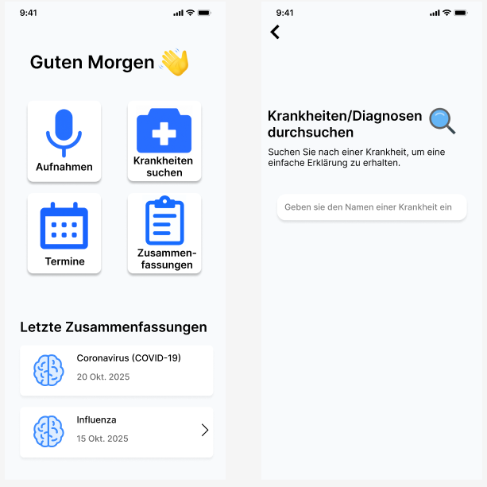
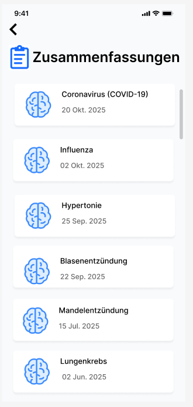

# ReMindHealth  
Eine KI‑gestützte Webanwendung zur automatischen Extraktion, Strukturierung und verständlichen Darstellung medizinischer Informationen aus Arztgesprächen.

---

##  Projektüberblick

ReMindHealth wurde im Rahmen eines Hochschulprojekts entwickelt und unterstützt Patientinnen und Patienten dabei, medizinische Inhalte aus Arztgesprächen besser zu verstehen und langfristig zu organisieren.  
Die Anwendung ermöglicht:

- das Aufnehmen von Arztgesprächen  
- die automatische Transkription  
- die KI‑gestützte Extraktion von Diagnosen, Symptomen und Terminen  
- die strukturierte Darstellung der Ergebnisse  
- die Verwaltung aller extrahierten und manuellen Termine  

Die Web‑App basiert auf **Blazor Server** und folgt einer **Clean‑Architecture‑Struktur**.

---

##  Hauptfunktionen

###  Aufnahme & Transkription
- Sprachaufnahme direkt im Browser  
- Visuelle Aufnahme‑Animationen  
- Live‑Statusanzeige (bereit / Aufnahme läuft)  
- KI‑gestützte Transkription (AssemblyAI)  
- Möglichkeit zur manuellen Nachbearbeitung  

###  Automatische Zusammenfassungen
- KI‑Analyse der Transkription (Gemini)  
- Extraktion von:
  - Diagnosen  
  - Symptomen  
  - Empfehlungen  
  - Terminen  
- Medizinische Erklärungen in verständlicher Sprache  
- Favoriten‑Markierung  

###  Terminverwaltung
- Übersicht aller extrahierten und manuellen Termine  
- Farblogik für Fälligkeiten:
  - Rot = überfällig  
  - Orange = heute  
  - Blau = bald  
  - Grün = Zukunft  
- Detailansicht mit Uhrzeit, Ort, Beschreibung, Dauer, Teilnehmern  
- Modale für:
  - Termin hinzufügen  
  - Termin bearbeiten  
  - Termin löschen  

###  Krankheitensuche
- Suchfeld mit Animation  
- Lade‑Spinner  
- Medizinische Erklärungen in Abschnitten  
- Symptome, Diagnoseverfahren, Behandlung  
- Warnhinweise und wichtige Hinweise  

###  Zusammenfassungsübersicht
- Kartenlayout aller bisherigen Arztgespräche  
- Filter (alle, abgeschlossen, fehlgeschlagen, in Bearbeitung)  
- Detailansicht mit:
  - Transkript  
  - extrahierten Krankheiten  
  - extrahierten Terminen  
  - Notizen  

---

##  Architekturüberblick

Das Projekt folgt einer **Clean Architecture** mit klarer Trennung der Schichten:

ReMindHealth.sln
│
├── ReMindHealth (Blazor Web / UI)
├── ReMindHealth.Application (Business-Logik, Interfaces, Services)
├── ReMindHealth.Domain (Modelle & Kernlogik)
├── ReMindHealth.Infrastructure (Datenbank, externe KI-Dienste)
└── ReMindHealth.Tests (Unit Tests)

### **Application Layer**
Enthält alle Interfaces und Business‑Services:

- `IAppointmentService`
- `IConversationService`
- `IUserService`
- `INoteService`
- `ITaskService`
- `IExtractionService`
- `IDiseaseSearchService`
- `ITranscriptionService`

### **Domain Layer**
- Kernmodelle wie:
  - `Conversation`
  - `ExtractedAppointment`
  - `Note`
  - `TaskItem`

### **Infrastructure Layer**
Implementierungen für:

- Datenbankzugriff (EF Core)
- externe KI‑Dienste:
  - `GeminiExtractionService`
  - `GeminiDiseaseSearchService`
  - `AssemblyAITranscriptionService`

### **Web Layer (Blazor Server)**
- UI‑Komponenten  
- Navigation  
- Authentifizierung  
- State‑Management  

---

##  Tech‑Stack

| Bereich  | Technologien                                   |
|--------  |------------------------------------------------|
| Frontend | Blazor Server, Razor Components, CSS‑Isolation |
| Backend  | ASP.NET Core, C#, EF Core, Identity            |
| KI       | Gemini API, AssemblyAI                         |
| DB       | SQL Server                                     |
| Tools    | Figma, Trello, Discord, GitHub, Docker         |

---

##  Screenshots



- Dashboard  
- Aufnahme‑Flow  
- Krankheitensuche  
- Terminverwaltung  
- Zusammenfassungen  

---

## Lizenz
Dieses Projekt wurde im Rahmen eines Hochschulprojekts entwickelt.
Keine kommerzielle Nutzung ohne Genehmigung.


##  Team & Rollen

- **Jakob Gauch** – Projektorganisation, Figma‑Design, Logo, Value Proposition  
- **Fatih Aydin** – User Stories, User Tests, Frontend‑Unterstützung, Unit Tests  
- **Rama AlAboud** – Idee, Name, User Stories, KI‑Evaluierung, Unit Tests  
- **Rabie Aalilou** –  UI‑Entwicklung (Frontend)
- **Mohammad Ayoubi** – Backend‑Implementierung, Datenbank, Services  

---

##  Installation & Start

###  Lokal starten
```bash
git clone https://github.com/HastyAy/ReMindHealth.git
cd ReMindHealth
dotnet run

### Mit Docker starten
docker-compose up --build


